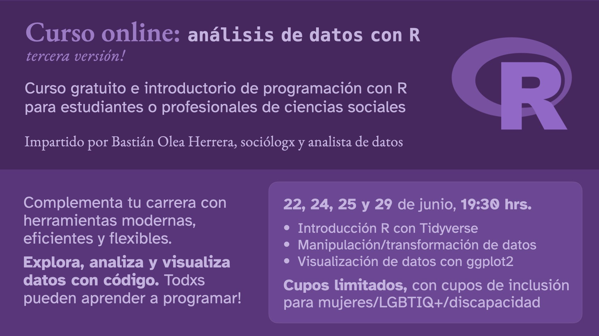

## Curso gratuito: introducción al análisis de datos con R, tercera versión

Diapositivas: https://bastianolea.github.io/curso_intro_R_3/

Información e inscripciones: https://bastianolea.rbind.io/blog/curso_r_intro_3/

## Código de conducta

Este cursos y sus materiales son parte del [código de conducta Contributor Covenant](https://contributor-covenant.org/version/2/1/CODE_OF_CONDUCT.html). Al participar de este proyecto, aceptas cumplir con sus términos.